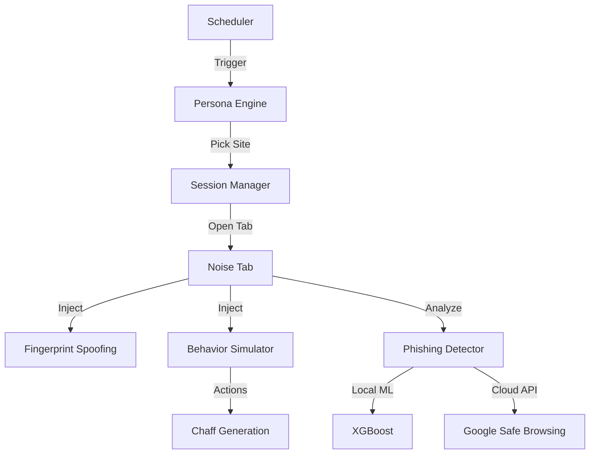

# 🛡️ Digital Chaff Generator (DCG)


> **"If they're tracking you, give them garbage."**
> 
> Digital Chaff Generator (DCG) is a premium privacy-defense tool that fights browser fingerprinting by generating high-fidelity background browsing "noise." By simulating realistic human behavior on a rotating set of personas, it effectively pollutes the data profiles trackers attempt to build on you.

---

## 🚀 Key Features

*   🎭 **Persona-Driven Noise**: Automatically rotates between 5 distinct personas (*Tech, Health, Finance, Travel, News*) every 2 hours.
*   🤖 **Human Simulation**: Advanced behavior engine that scrolls, moves the mouse, and selects text to mimic real human reading patterns.
*   🧭 **Deep Exploration**: Not just page loads—the extension clicks internal links to explore sites deeply, generating more complex tracking "chaff."
*   🛡️ **Dual-Engine Phishing Protection**: 
    *   **Cloud**: Live Google Safe Browsing API integration.
    *   **Local**: Offline XGBoost ML model (98.86% accuracy) for instant URL analysis.
*   🧬 **Fingerprint Spoofing**: Active disruption of Canvas and WebGL fingerprinting scripts via noise injection.
*   🧹 **Smart Cookie Cleanup**: Risk-based cookie management with three selectable intensity levels.
*   📉 **Profile Certainty Metrics**: Real-time visualization of your "anonymity score" based on generated noise volume.

---

## 🛠️ Technical Stack

### Core Extension
| Technology | Usage |
| :--- | :--- |
| **JavaScript (ES6+)** | Core logic, Service Workers, and UI orchestration. |
| **Manifest V3** | Built on the latest, secure Chrome Extension architecture. |
| **Webpack 5** | Module bundling, minification, and production optimization. |
| **Dotenv** | Secure environment variable management for API keys. |
| **CSS3** | Premium "Light Luxury" UI with glassmorphism and smooth animations. |

### Machine Learning
| Technology | Usage |
| :--- | :--- |
| **Python 3.10** | Dataset classification and model training pipeline. |
| **XGBoost** | High-performance gradient boosting for phishing detection. |
| **Pandas** | Large-scale data processing for training datasets. |

---

## 📦 Installation & Setup

### 1. Build from Source
Ensure you have [Node.js](https://nodejs.org/) installed.

```bash
# Install dependencies
npm install

# Create your environment file
echo "SAFE_BROWSING_API_KEY=YOUR_KEY_HERE" > .env

# Build the production bundle
npm run build
```

### 2. Load into Chrome
1.  Open Chrome and navigate to `chrome://extensions/`.
2.  Enable **Developer mode** (top-right).
3.  Click **Load unpacked**.
4.  Select the **`dist`** folder created by the build process.

---

## 🛡️ Privacy First

- **Zero-Knowledge Architecture**: No personal browsing data ever leaves your device.
- **Local Inference**: The phishing detection ML model runs entirely on your hardware.
- **No Analytics**: We do not track users. The code is open and transparent.

---

## 🧠 Architecture Overview



---

## ⚖️ License

Distributed under the MIT License. See `LICENSE` for more information.

---

<p align="center">
  <i>Developed for the privacy-conscious web.</i><br>
  <b>Digital Chaff Generator &copy; 2026</b>
</p>
